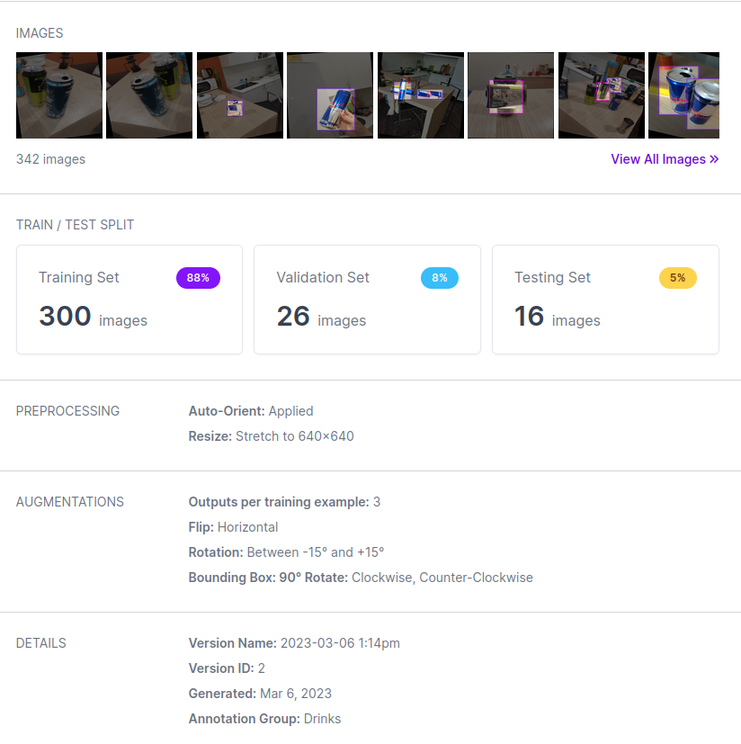
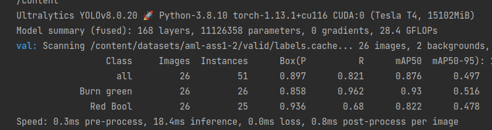
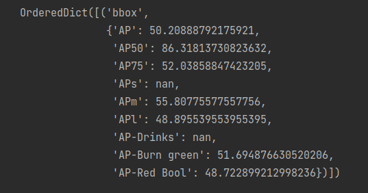
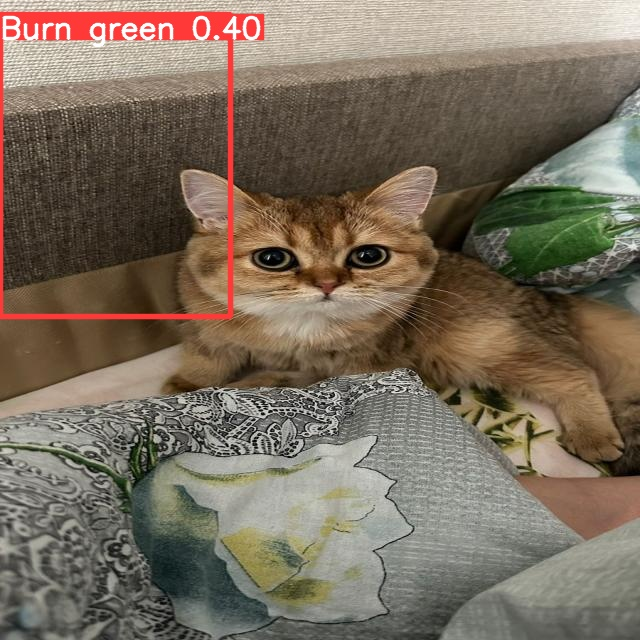
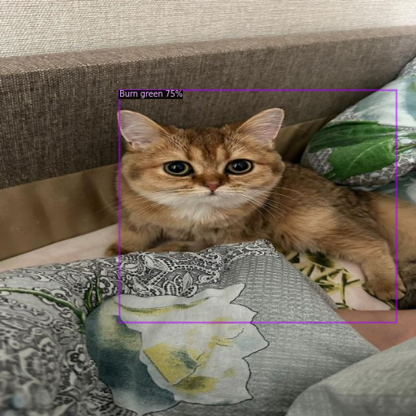
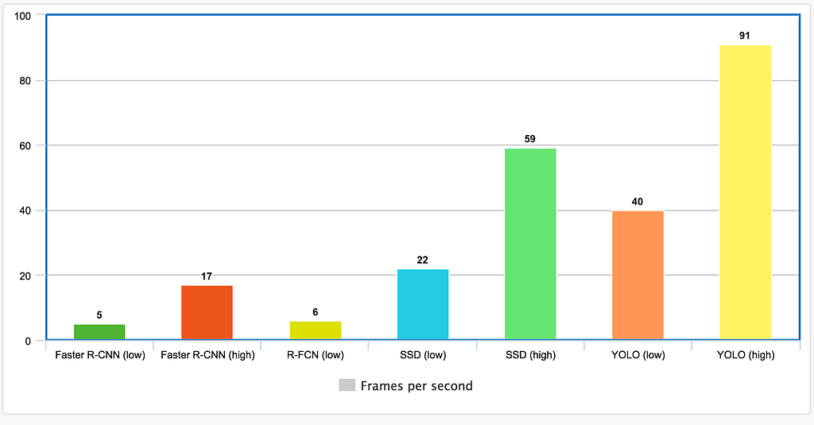

1) As my dataset I chose photos of energy drinks. In my dataset i have 2 classes in total. 
- Red bull (written with a typo in my notebooks)
- Green Burn
In my dataset i tried to make all the possible positions of the cans(Vertical, horizontal, reversed etc.) to make my detection model as general as possible. And in total in my final dataset I got 142 photos. As an experiment in some of the photos I didn't have any of the classes, to see, that will model do in such a case.

2) Step two is to manually annotate all the photos in roboflow. This is one of the most tedious steps as it doesn't require any special skills, but it does take some time. After that, I could easily create a dataset with roboflow, even with already annotated photos. And after the augmentation I got 342 photos (300 in train, 26 in valid and 16 in test).  
 
 and after this with the help of the roboflow lib for python, import this dataset to my notebook is simply 
```python
!pip install roboflow

from roboflow import Roboflow
rf = Roboflow(api_key="i5a31149ZXb5vXFpPtOS")
project = rf.workspace("ds-sdvyu").project("aml-ass1")
dataset = project.version(2).download("yolov8")
```

3)  For the detecron2 and faster RCNN I do the following steps:
- Install the data set from Roboflow in COCO format.
- Register COCO instances for training, test and validation data
- Define config for the model with all required parameters.
- Create a COCO trainer with the generated config and train the faster RCNN from the model_zoo of the detectron.
- Check the results of the model training in the test dataset
The code of the training process can be found in the file `Detectron2_RCCN.ipynb` or with the following colab link [here](https://colab.research.google.com/drive/1QQJWLg61ZK5pgKLguKhX8zFoEeP8FMts?usp=sharing)

4) For the YoloV8 model, I take the next steps:
- Download the dataset specially prepared for the YoloV8 model using the roboflow API.
- install the Yolo model with the ultralytics python lib
- train Yolo on my custom dataset using the CLI command (it's just 1 line of code)
- Check the results of the model predictions on the validation and test datasets.
Notebook with the code of YoloV8 training process can be found in the file `YoloV8.ipynb` by the following colab link [here](https://colab.research.google.com/drive/1v68zZk8oGCNqO5AWJpmm9xDTLDn0HpC4?usp=sharing)

5) In terms of metrics I got the following resutls:
For the **YoloV8:**
On the val data


For the **Faster RCNN**:
On the val data

* In terms of the MeanAveragePrecision both models got moreless the same result. So, they can be considered as equal. Both models do not works perfectly. In the test inference both models detect instance of the Green burn in the picture of cat
 
Model give the following results, beacuse in the training dataset is pretty small. And allmost all the training data contains one of the classes in the picture. Thats why, model tries to detect something, that is not energy drink in fact.


* In terms of time.  YoloV8 spend ~10 second to train on 1 of 25 epoch. And faster RCNN spend ~50 minuts on training with ~40 seconds per epoch (aprox. 75 epochs). So, Faster RCNN needs more epochs to converge and takes 4 time more time per epoch .
 
In the picture above we may see, that after some experements, researches get, that YOLO of the smallest size works >2 times faster then Faster R-CNN.


* In terms of size
 - YoloV8 used 6.91GB of VRAM during the training process.
 - Faster R-CNN in my configuration uses ResNeXt-101-32x8d model (from Detectron documentation) and it uses aproximately 6.7GB of VRAM during the train.
 So from this we came to the conclusion that models have +- equivalent size.
